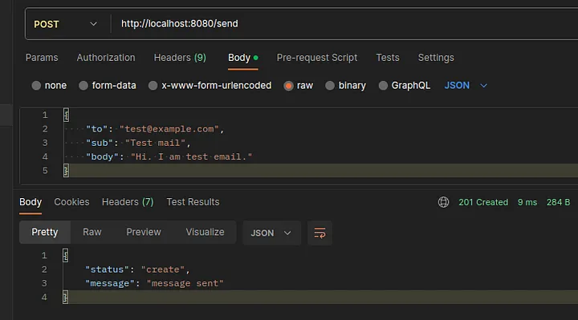
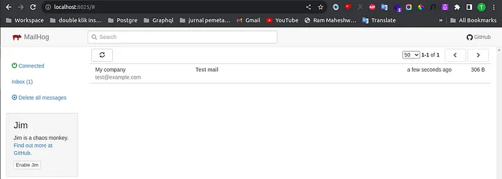

## 🚀 Membangun SMTP Server Palsu dengan Express, MailHog dan Docker

Tutorial lengkap ada di Medium. Berikut link menuju artikel https://medium.com/@tegarpenemuan/membangun-smtp-server-palsu-dengan-mailhog-dan-docker-56fb429214d4

## ✨ Demo Hasil
Berikut adalah hasil yang dibuat:

### Request 

### Response

## 🛠️ Alat 
- docker
- express
- extention vscode - rest client

## 📙 Menjalankan Projek
1. Menjalankan docker compose `docker compose up -d`
2. Install dependensi node `npm i`
3. Jalankan projek dengan `npm run dev`
4. Jalankan link berikut di browser `http://localhost:8025/`
5. Buka file `test.http` pastikan sudah instal extention rest client dan klik `Send Request`
6. Refresh `http://localhost:8025/` dan lihat email sudah masuk.
